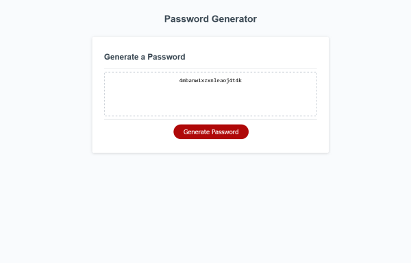

# Password-Generator
Using javascript to generate a secure password

## Generating passwords based on user input

This project has been created to demonstrate how user inputted data can be stored and manipulated using JavaScript. 
Functions, arrays and operators and conditional statements are used.

## Usage

View on GitHub Pages here: [https://webtam81.github.io/Password-Generator/](https://webtam81.github.io/Password-Generator/), click on 'Generate Password' and then follow the on-page instructions to choose your password options.

## License

MIT License. See license file for further details.